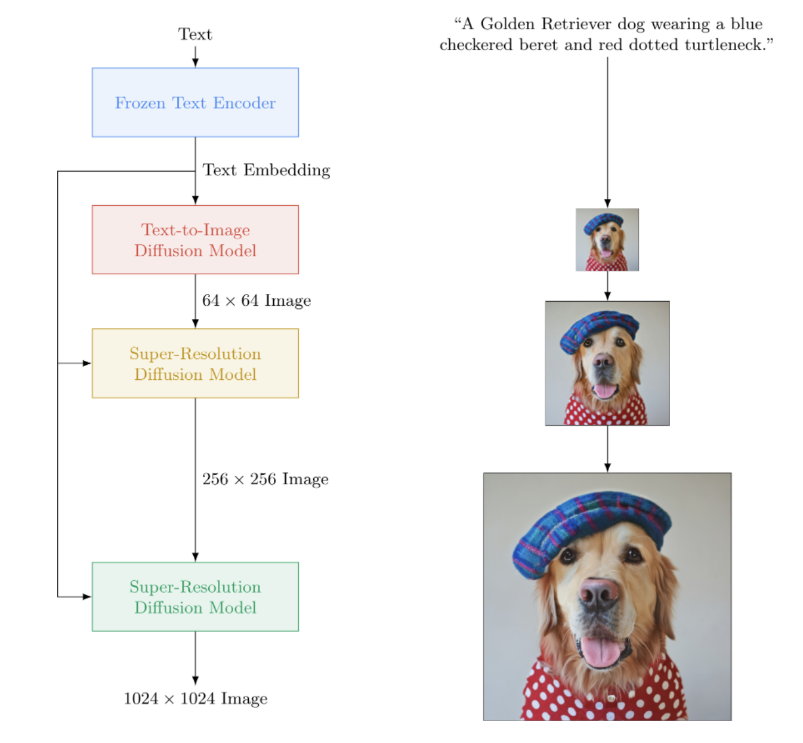

</img>

## Imagen - Pytorch

Implementation of <a href="https://gweb-research-imagen.appspot.com/">Imagen</a>, Google's Text-to-Image Neural Network that beats DALL-E2, in Pytorch. It is the new SOTA for text-to-image synthesis.

Architecturally, it is actually much simpler than DALL-E2. It consists of a cascading DDPM conditioned on text embeddings from a large pretrained T5 model (attention network). It also contains dynamic clipping for improved classifier free guidance, noise level conditioning, and a memory efficient unet design.

It appears neither CLIP nor prior network is needed after all. And so research continues.

<a href="https://www.youtube.com/watch?v=xqDeAz0U-R4">AI Coffee Break with Letitia</a> | <a href="https://www.assemblyai.com/blog/how-imagen-actually-works/">Assembly AI</a> | <a href="https://www.youtube.com/watch?v=af6WPqvzjjk">Yannic Kilcher</a>

Please join <a href="https://discord.gg/xBPBXfcFHd"></a> if you are interested in helping out with the replication with the <a href="https://laion.ai/">LAION</a> community

## Shoutouts

- <a href="https://stability.ai/">StabilityAI</a> for the generous sponsorship, as well as my other sponsors out there

- <a href="https://huggingface.co/">🤗 Huggingface</a> for their amazing transformers library. The text encoder portion is pretty much taken care of because of them

- <a href="http://www.jonathanho.me/">Jonathan Ho</a> for bringing about a revolution in generative artificial intelligence through <a href="https://arxiv.org/abs/2006.11239">his seminal paper</a>

- <a href="https://github.com/sgugger">Sylvain</a> and <a href="https://github.com/muellerzr">Zachary</a> for the <a href="https://github.com/huggingface/accelerate">Accelerate</a> library, which this repository uses for distributed training

- <a href="https://github.com/arogozhnikov">Alex</a> for <a href="https://github.com/arogozhnikov/einops">einops</a>, indispensable tool for tensor manipulation

- <a href="https://github.com/jorgemcgomes">Jorge Gomes</a> for helping out with the T5 loading code and advice on the correct T5 version

- <a href="https://github.com/crowsonkb">Katherine Crowson</a>, for her <a href="https://github.com/crowsonkb/v-diffusion-jax/blob/master/diffusion/utils.py">beautiful code</a>, which helped me understand the continuous time version of gaussian diffusion

- <a href="https://github.com/marunine">Marunine</a> and <a href="https://github.com/Netruk44">Netruk44</a>, for reviewing code, sharing experimental results, and help with debugging

- <a href="https://github.com/marunine">Marunine</a> for providing a <a href="https://github.com/lucidrains/imagen-pytorch/issues/72#issuecomment-1163275757">potential solution</a> for a color shifting issue in the memory efficient u-nets. Thanks to <a href="https://github.com/jacobwjs">Jacob</a> for sharing experimental comparisons between the base and memory-efficient unets

- <a href="https://github.com/marunine">Marunine</a> for finding numerous bugs, resolving an issue with resize right, and for sharing his experimental configurations and results

- <a href="https://github.com/MalumaDev">MalumaDev</a> for proposing the use of pixel shuffle upsampler to fix checkboard artifacts

- <a href="https://github.com/KhrulkovV">Valentin</a> for pointing out insufficient skip connections in the unet, as well as the specific method of attention conditioning in the base-unet in the appendix

- <a href="https://github.com/BIGJUN777">BIGJUN</a> for catching a big bug with continuous time gaussian diffusion noise level conditioning at inference time

- <a href="https://github.com/animebing">Bingbing</a> for identifying a bug with sampling and order of normalizing and noising with low resolution conditioning image

- <a href="https://github.com/TheFusion21">Kay</a> for contributing one line command training of Imagen!

- <a href="https://github.com/HReynaud">Hadrien Reynaud</a> for testing out text-to-video on a medical dataset, sharing his results, and identifying issues!

## Install

```bash
$ pip install imagen-pytorch
```

## Usage

```python
import torch
from imagen_pytorch import Unet, Imagen

# unet for imagen

unet1 = Unet(
    dim = 32,
    cond_dim = 512,
    dim_mults = (1, 2, 4, 8),
    num_resnet_blocks = 3,
    layer_attns = (False, True, True, True),
    layer_cross_attns = (False, True, True, True)
)

unet2 = Unet(
    dim = 32,
    cond_dim = 512,
    dim_mults = (1, 2, 4, 8),
    num_resnet_blocks = (2, 4, 8, 8),
    layer_attns = (False, False, False, True),
    layer_cross_attns = (False, False, False, True)
)

# imagen, which contains the unets above (base unet and super resoluting ones)

imagen = Imagen(
    unets = (unet1, unet2),
    image_sizes = (64, 256),
    timesteps = 1000,
    cond_drop_prob = 0.1
).cuda()

# mock images (get a lot of this) and text encodings from large T5

text_embeds = torch.randn(4, 256, 768).cuda()
images = torch.randn(4, 3, 256, 256).cuda()

# feed images into imagen, training each unet in the cascade

for i in (1, 2):
    loss = imagen(images, text_embeds = text_embeds, unet_number = i)
    loss.backward()

# do the above for many many many many steps
# now you can sample an image based on the text embeddings from the cascading ddpm

images = imagen.sample(texts = [
    'a whale breaching from afar',
    'young girl blowing out candles on her birthday cake',
    'fireworks with blue and green sparkles'
], cond_scale = 3.)

images.shape # (3, 3, 256, 256)
```

For simpler training, you can directly supply text strings instead of precomputing text encodings. (Although for scaling purposes, you will definitely want to precompute the textual embeddings + mask)

The number of textual captions must match the batch size of the images if you go this route.

```python
# mock images and text (get a lot of this)

texts = [
    'a child screaming at finding a worm within a half-eaten apple',
    'lizard running across the desert on two feet',
    'waking up to a psychedelic landscape',
    'seashells sparkling in the shallow waters'
]

images = torch.randn(4, 3, 256, 256).cuda()

# feed images into imagen, training each unet in the cascade

for i in (1, 2):
    loss = imagen(images, texts = texts, unet_number = i)
    loss.backward()
```

With the `ImagenTrainer` wrapper class, the exponential moving averages for all of the U-nets in the cascading DDPM will be automatically taken care of when calling `update`

```python
import torch
from imagen_pytorch import Unet, Imagen, ImagenTrainer

# unet for imagen

unet1 = Unet(
    dim = 32,
    cond_dim = 512,
    dim_mults = (1, 2, 4, 8),
    num_resnet_blocks = 3,
    layer_attns = (False, True, True, True),
)

unet2 = Unet(
    dim = 32,
    cond_dim = 512,
    dim_mults = (1, 2, 4, 8),
    num_resnet_blocks = (2, 4, 8, 8),
    layer_attns = (False, False, False, True),
    layer_cross_attns = (False, False, False, True)
)

# imagen, which contains the unets above (base unet and super resoluting ones)

imagen = Imagen(
    unets = (unet1, unet2),
    text_encoder_name = 't5-large',
    image_sizes = (64, 256),
    timesteps = 1000,
    cond_drop_prob = 0.1
).cuda()

# wrap imagen with the trainer class

trainer = ImagenTrainer(imagen)

# mock images (get a lot of this) and text encodings from large T5

text_embeds = torch.randn(64, 256, 1024).cuda()
images = torch.randn(64, 3, 256, 256).cuda()

# feed images into imagen, training each unet in the cascade

loss = trainer(
    images,
    text_embeds = text_embeds,
    unet_number = 1,            # training on unet number 1 in this example, but you will have to also save checkpoints and then reload and continue training on unet number 2
    max_batch_size = 4          # auto divide the batch of 64 up into batch size of 4 and accumulate gradients, so it all fits in memory
)

trainer.update(unet_number = 1)

# do the above for many many many many steps
# now you can sample an image based on the text embeddings from the cascading ddpm

images = trainer.sample(texts = [
    'a puppy looking anxiously at a giant donut on the table',
    'the milky way galaxy in the style of monet'
], cond_scale = 3.)

images.shape # (2, 3, 256, 256)
```

You can also train Imagen without text (unconditional image generation) as follows

```python
import torch
from imagen_pytorch import Unet, Imagen, SRUnet256, ImagenTrainer

# unets for unconditional imagen

unet1 = Unet(
    dim = 32,
    dim_mults = (1, 2, 4),
    num_resnet_blocks = 3,
    layer_attns = (False, True, True),
    layer_cross_attns = False,
    use_linear_attn = True
)

unet2 = SRUnet256(
    dim = 32,
    dim_mults = (1, 2, 4),
    num_resnet_blocks = (2, 4, 8),
    layer_attns = (False, False, True),
    layer_cross_attns = False
)

# imagen, which contains the unets above (base unet and super resoluting ones)

imagen = Imagen(
    condition_on_text = False,   # this must be set to False for unconditional Imagen
    unets = (unet1, unet2),
    image_sizes = (64, 128),
    timesteps = 1000
)

trainer = ImagenTrainer(imagen).cuda()

# now get a ton of images and feed it through the Imagen trainer

training_images = torch.randn(4, 3, 256, 256).cuda()

# train each unet separately
# in this example, only training on unet number 1

loss = trainer(training_images, unet_number = 1)
trainer.update(unet_number = 1)

# do the above for many many many many steps
# now you can sample images unconditionally from the cascading unet(s)

images = trainer.sample(batch_size = 16) # (16, 3, 128, 128)
```

Or train only super-resoluting unets

```python
import torch
from imagen_pytorch import Unet, NullUnet, Imagen

# unet for imagen

unet1 = NullUnet()  # add a placeholder "null" unet for the base unet

unet2 = Unet(
    dim = 32,
    cond_dim = 512,
    dim_mults = (1, 2, 4, 8),
    num_resnet_blocks = (2, 4, 8, 8),
    layer_attns = (False, False, False, True),
    layer_cross_attns = (False, False, False, True)
)

# imagen, which contains the unets above (base unet and super resoluting ones)

imagen = Imagen(
    unets = (unet1, unet2),
    image_sizes = (64, 256),
    timesteps = 250,
    cond_drop_prob = 0.1
).cuda()

# mock images (get a lot of this) and text encodings from large T5

text_embeds = torch.randn(4, 256, 768).cuda()
images = torch.randn(4, 3, 256, 256).cuda()

# feed images into imagen, training each unet in the cascade

loss = imagen(images, text_embeds = text_embeds, unet_number = 2)
loss.backward()

# do the above for many many many many steps
# now you can sample an image based on the text embeddings as well as low resolution images

lowres_images = torch.randn(3, 3, 64, 64).cuda()  # starting un-resoluted images

images = imagen.sample(
    texts = [
        'a whale breaching from afar',
        'young girl blowing out candles on her birthday cake',
        'fireworks with blue and green sparkles'
    ],
    start_at_unet_number = 2,              # start at unet number 2
    start_image_or_video = lowres_images,  # pass in low resolution images to be resoluted
    cond_scale = 3.)

images.shape # (3, 3, 256, 256)
```

At any time you can save and load the trainer and all associated states with the `save` and `load` methods. It is recommended you use these methods instead of manually saving with a `state_dict` call, as there are some device memory management being done underneath the hood within the trainer.

ex.

```python
trainer.save('./path/to/checkpoint.pt')

trainer.load('./path/to/checkpoint.pt')

trainer.steps # (2,) step number for each of the unets, in this case 2
```

## Dataloader

You can also rely on the `ImagenTrainer` to automatically train off `DataLoader` instances. You simply have to craft your `DataLoader` to return either `images` (for unconditional case), or of `('images', 'text_embeds')` for text-guided generation.

ex. unconditional training

```python
from imagen_pytorch import Unet, Imagen, ImagenTrainer
from imagen_pytorch.data import Dataset

# unets for unconditional imagen

unet = Unet(
    dim = 32,
    dim_mults = (1, 2, 4, 8),
    num_resnet_blocks = 1,
    layer_attns = (False, False, False, True),
    layer_cross_attns = False
)

# imagen, which contains the unet above

imagen = Imagen(
    condition_on_text = False,  # this must be set to False for unconditional Imagen
    unets = unet,
    image_sizes = 128,
    timesteps = 1000
)

trainer = ImagenTrainer(
    imagen = imagen,
    split_valid_from_train = True # whether to split the validation dataset from the training
).cuda()

# instantiate your dataloader, which returns the necessary inputs to the DDPM as tuple in the order of images, text embeddings, then text masks. in this case, only images is returned as it is unconditional training

dataset = Dataset('/path/to/training/images', image_size = 128)

trainer.add_train_dataset(dataset, batch_size = 16)

# working training loop

for i in range(200000):
    loss = trainer.train_step(unet_number = 1, max_batch_size = 4)
    print(f'loss: {loss}')

    if not (i % 50):
        valid_loss = trainer.valid_step(unet_number = 1, max_batch_size = 4)
        print(f'valid loss: {valid_loss}')

    if not (i % 100) and trainer.is_main: # is_main makes sure this can run in distributed
        images = trainer.sample(batch_size = 1, return_pil_images = True) # returns List[Image]
        images[0].save(f'./sample-{i // 100}.png')

```

## Multi GPU

Thanks to <a href="https://huggingface.co/docs/accelerate/index">🤗 Accelerate</a>, you can do multi GPU training easily with two steps.

First you need to invoke `accelerate config` in the same directory as your training script (say it is named `train.py`)

```bash
$ accelerate config
```

Next, instead of calling `python train.py` as you would for single GPU, you would use the accelerate CLI as so

```bash
$ accelerate launch train.py
```

That's it!

## Command-line

Imagen can also be used via CLI directly.

### Configuration

ex.

```bash
$ imagen config
```
or
```bash
$ imagen config --path ./configs/config.json
```

In the config you are able to change settings for the trainer, dataset and the imagen config.

The Imagen config parameters can be found <a href="https://github.com/lucidrains/imagen-pytorch/blob/f8cc75f4d9020998c577b3770d3f260ce2ee2dcf/imagen_pytorch/configs.py#L68">here</a>

The Elucidated Imagen config parameters can be found <a href="https://github.com/lucidrains/imagen-pytorch/blob/f8cc75f4d9020998c577b3770d3f260ce2ee2dcf/imagen_pytorch/configs.py#L108">here</a>

The Imagen Trainer config parameters can be found <a href="https://github.com/lucidrains/imagen-pytorch/blob/f8cc75f4d9020998c577b3770d3f260ce2ee2dcf/imagen_pytorch/trainer.py#L226">here</a>

For the dataset parameters all dataloader parameters can be used.

### Training

This command allows you to train or resume training your model

ex.
```bash
$ imagen train
```
or
```bash
$ imagen train --unet 2 --epoches 10
```

You can pass following arguments to the training command.

- `--config` specify the config file to use for training [default: ./imagen_config.json]
- `--unet` the index of the unet to train [default: 1]
- `--epoches` how many epoches to train for [default: 50]

### Sampling

Be aware when sampling your checkpoint should have trained all unets to get a usable result.

ex.

```bash
$ imagen sample --model ./path/to/model/checkpoint.pt "a squirrel raiding the birdfeeder"
# image is saved to ./a_squirrel_raiding_the_birdfeeder.png
```

You can pass following arguments to the sample command.

- `--model` specify the model file to use for sampling
- `--cond_scale` conditioning scale (classifier free guidance) in decoder
- `--load_ema` load EMA version of unets if available

In order to use a saved checkpoint with this feature, you either must instantiate your Imagen instance using the config classes, `ImagenConfig` and `ElucidatedImagenConfig` or create a checkpoint via the CLI directly

For proper training, you'll likely want to setup config-driven training anyways.

ex.

```python
import torch
from imagen_pytorch import ImagenConfig, ElucidatedImagenConfig, ImagenTrainer

# in this example, using elucidated imagen

imagen = ElucidatedImagenConfig(
    unets = [
        dict(dim = 32, dim_mults = (1, 2, 4, 8)),
        dict(dim = 32, dim_mults = (1, 2, 4, 8))
    ],
    image_sizes = (64, 128),
    cond_drop_prob = 0.5,
    num_sample_steps = 32
).create()

trainer = ImagenTrainer(imagen)

# do your training ...

# then save it

trainer.save('./checkpoint.pt')

# you should see a message informing you that ./checkpoint.pt is commandable from the terminal
```

It really should be as simple as that

You can also pass this checkpoint file around, and anyone can continue finetune on their own data

```python
from imagen_pytorch import load_imagen_from_checkpoint, ImagenTrainer

imagen = load_imagen_from_checkpoint('./checkpoint.pt')

trainer = ImagenTrainer(imagen)

# continue training / fine-tuning
```

## Inpainting

Inpainting follows the formulation laid out by the recent <a href="https://arxiv.org/abs/2201.09865">Repaint paper</a>. Simply pass in `inpaint_images` and `inpaint_masks` to the `sample` function on either `Imagen` or `ElucidatedImagen`

```python

inpaint_images = torch.randn(4, 3, 512, 512).cuda()      # (batch, channels, height, width)
inpaint_masks = torch.ones((4, 512, 512)).bool().cuda()  # (batch, height, width)

inpainted_images = trainer.sample(texts = [
    'a whale breaching from afar',
    'young girl blowing out candles on her birthday cake',
    'fireworks with blue and green sparkles',
    'dust motes swirling in the morning sunshine on the windowsill'
], inpaint_images = inpaint_images, inpaint_masks = inpaint_masks, cond_scale = 5.)

inpainted_images # (4, 3, 512, 512)
```

For video, similarly pass in your videos to `inpaint_videos` keyword on `.sample`. Inpainting mask can either be the same across all frames `(batch, height, width)` or different `(batch, frames, height, width)`

```python

inpaint_videos = torch.randn(4, 3, 8, 512, 512).cuda()   # (batch, channels, frames, height, width)
inpaint_masks = torch.ones((4, 8, 512, 512)).bool().cuda()  # (batch, frames, height, width)

inpainted_videos = trainer.sample(texts = [
    'a whale breaching from afar',
    'young girl blowing out candles on her birthday cake',
    'fireworks with blue and green sparkles',
    'dust motes swirling in the morning sunshine on the windowsill'
], inpaint_videos = inpaint_videos, inpaint_masks = inpaint_masks, cond_scale = 5.)

inpainted_videos # (4, 3, 8, 512, 512)
```

## Experimental

<a href="https://research.nvidia.com/person/tero-karras">Tero Karras</a> of StyleGAN fame has written a <a href="https://arxiv.org/abs/2206.00364">new paper</a> with results that have been corroborated by a number of independent researchers as well as on my own machine. I have decided to create a version of `Imagen`, the `ElucidatedImagen`, so that one can use the new elucidated DDPM for text-guided cascading generation.

Simply import `ElucidatedImagen`, and then instantiate the instance as you did before. The hyperparameters are different than the usual ones for discrete and continuous time gaussian diffusion, and can be individualized for each unet in the cascade.

Ex.

```python
from imagen_pytorch import ElucidatedImagen

# instantiate your unets ...

imagen = ElucidatedImagen(
    unets = (unet1, unet2),
    image_sizes = (64, 128),
    cond_drop_prob = 0.1,
    num_sample_steps = (64, 32), # number of sample steps - 64 for base unet, 32 for upsampler (just an example, have no clue what the optimal values are)
    sigma_min = 0.002,           # min noise level
    sigma_max = (80, 160),       # max noise level, @crowsonkb recommends double the max noise level for upsampler
    sigma_data = 0.5,            # standard deviation of data distribution
    rho = 7,                     # controls the sampling schedule
    P_mean = -1.2,               # mean of log-normal distribution from which noise is drawn for training
    P_std = 1.2,                 # standard deviation of log-normal distribution from which noise is drawn for training
    S_churn = 80,                # parameters for stochastic sampling - depends on dataset, Table 5 in apper
    S_tmin = 0.05,
    S_tmax = 50,
    S_noise = 1.003,
).cuda()

# rest is the same as above

```

## Text to Video

This repository will also start accumulating new research around text guided video synthesis. For starters it will adopt the 3d unet architecture described by Jonathan Ho in <a href="https://arxiv.org/abs/2204.03458">Video Diffusion Models</a>

Update: verified <a href="https://github.com/lucidrains/imagen-pytorch/issues/305#issuecomment-1407015141">working</a> by <a href="https://github.com/HReynaud">Hadrien Reynaud</a>!

Ex.

```python
import torch
from imagen_pytorch import Unet3D, ElucidatedImagen, ImagenTrainer

unet1 = Unet3D(dim = 64, dim_mults = (1, 2, 4, 8)).cuda()

unet2 = Unet3D(dim = 64, dim_mults = (1, 2, 4, 8)).cuda()

# elucidated imagen, which contains the unets above (base unet and super resoluting ones)

imagen = ElucidatedImagen(
    unets = (unet1, unet2),
    image_sizes = (16, 32),
    random_crop_sizes = (None, 16),
    temporal_downsample_factor = (2, 1),        # in this example, the first unet would receive the video temporally downsampled by 2x
    num_sample_steps = 10,
    cond_drop_prob = 0.1,
    sigma_min = 0.002,                          # min noise level
    sigma_max = (80, 160),                      # max noise level, double the max noise level for upsampler
    sigma_data = 0.5,                           # standard deviation of data distribution
    rho = 7,                                    # controls the sampling schedule
    P_mean = -1.2,                              # mean of log-normal distribution from which noise is drawn for training
    P_std = 1.2,                                # standard deviation of log-normal distribution from which noise is drawn for training
    S_churn = 80,                               # parameters for stochastic sampling - depends on dataset, Table 5 in apper
    S_tmin = 0.05,
    S_tmax = 50,
    S_noise = 1.003,
).cuda()

# mock videos (get a lot of this) and text encodings from large T5

texts = [
    'a whale breaching from afar',
    'young girl blowing out candles on her birthday cake',
    'fireworks with blue and green sparkles',
    'dust motes swirling in the morning sunshine on the windowsill'
]

videos = torch.randn(4, 3, 10, 32, 32).cuda() # (batch, channels, time / video frames, height, width)

# feed images into imagen, training each unet in the cascade
# for this example, only training unet 1

trainer = ImagenTrainer(imagen)

# you can also ignore time when training on video initially, shown to improve results in video-ddpm paper. eventually will make the 3d unet trainable with either images or video. research shows it is essential (with current data regimes) to train first on text-to-image. probably won't be true in another decade. all big data becomes small data

trainer(videos, texts = texts, unet_number = 1, ignore_time = False)
trainer.update(unet_number = 1)

videos = trainer.sample(texts = texts, video_frames = 20) # extrapolating to 20 frames from training on 10 frames

videos.shape # (4, 3, 20, 32, 32)

```

You can also train on text - image pairs first. The `Unet3D` will automatically convert it to single framed videos and learn without the temporal components (by automatically setting `ignore_time = True`), whether it be 1d convolutions or causal attention across time.

This is the current approach taken by all the big artificial intelligence labs (Brain, MetaAI, Bytedance)

## FAQ

- Why are my generated images not aligning well with the text?

Imagen uses an algorithm called <a href="https://openreview.net/forum?id=qw8AKxfYbI">Classifier Free Guidance</a>. When sampling, you apply a scale to the conditioning (text in this case) of greater than `1.0`.

Researcher <a href="https://github.com/Netruk44 ">Netruk44</a> have reported `5-10` to be optimal, but anything greater than `10` to break.

```python
trainer.sample(texts = [
    'a cloud in the shape of a roman gladiator'
], cond_scale = 5.) # <-- cond_scale is the conditioning scale, needs to be greater than 1.0 to be better than average
```

- Are there any pretrained models yet?

Not at the moment but one will likely be trained and open sourced within the year, if not sooner. If you would like to participate, you can join the community of artificial neural network trainers at Laion (discord link is in the Readme above) and start collaborating.

- Will this technology take my job?

More the reason why you should start training your own model, starting today! The last thing we need is this technology being in the hands of an elite few. Hopefully this repository reduces the work to just finding the necessary compute, and augmenting with your own curated dataset.

- What am I allowed to do with this repository?

Anything! It is MIT licensed. In other words, you can freely copy / paste for your own research, remixed for whatever modality you can think of. Go train amazing models for profit, for science, or simply to satiate your own personal pleasure at witnessing something divine unravel in front of you.

## Cool Applications!

- <a href="https://arxiv.org/abs/2303.12644">Echocardiogram synthesis</a> <a href="https://github.com/HReynaud/EchoDiffusion">[Code]</a>

- <a href="https://www.biorxiv.org/content/10.1101/2023.10.25.564065v1">SOTA Hi-C contact matrix synthesis</a> <a href="https://github.com/CHNFTQ/Capricorn">[Code]</a>

- <a href="https://arxiv.org/abs/2311.15941">Floor plan generation</a>

- <a href="https://arxiv.org/abs/2312.01152">Ultra High Resolution Histopathology Slides</a>

- <a href="https://arxiv.org/abs/2312.03043">Synthetic Laparoscopic Images</a>

- <a href="https://www.nature.com/articles/s42256-023-00762-x">Designing MetaMaterials</a>

## Related Works

- <a href="https://github.com/archinetai/audio-diffusion-pytorch">Audio diffusion</a> from <a href="https://github.com/flavioschneider">Flavio Schneider</a>

- <a href="https://github.com/AssemblyAI-Examples/MinImagen">Mini Imagen</a> from <a href="https://github.com/oconnoob">Ryan O.</a> | <a href="https://www.assemblyai.com/blog/build-your-own-imagen-text-to-image-model/">AssemblyAI writeup</a>

## Todo

- [x] use huggingface transformers for T5-small text embeddings
- [x] add dynamic thresholding
- [x] add dynamic thresholding DALLE2 and video-diffusion repository as well
- [x] allow for one to set T5-large (and perhaps small factory method to take in any huggingface transformer)
- [x] add the lowres noise level with the pseudocode in appendix, and figure out what is this sweep they do at inference time
- [x] port over some training code from DALLE2
- [x] need to be able to use a different noise schedule per unet (cosine was used for base, but linear for SR)
- [x] just make one master-configurable unet
- [x] complete resnet block (biggan inspired? but with groupnorm) - complete self attention
- [x] complete conditioning embedding block (and make it completely configurable, whether it be attention, film etc)
- [x] consider using perceiver-resampler from https://github.com/lucidrains/flamingo-pytorch in place of attention pooling
- [x] add attention pooling option, in addition to cross attention and film
- [x] add optional cosine decay schedule with warmup, for each unet, to trainer
- [x] switch to continuous timesteps instead of discretized, as it seems that is what they used for all stages - first figure out the linear noise schedule case from the variational ddpm paper https://openreview.net/forum?id=2LdBqxc1Yv
- [x] figure out log(snr) for alpha cosine noise schedule.
- [x] suppress the transformers warning because only T5encoder is used
- [x] allow setting for using linear attention on layers where full attention cannot be used
- [x] force unets in continuous time case to use non-fouriered conditions (just pass the log(snr) through an MLP with optional layernorms), as that is what i have working locally
- [x] removed learned variance
- [x] add p2 loss weighting for continuous time
- [x] make sure cascading ddpm can be trained without text condition, and make sure both continuous and discrete time gaussian diffusion works
- [x] use primer's depthwise convs on the qkv projections in linear attention (or use token shifting before projections) - also use new dropout proposed by bayesformer, as it seems to work well with linear attention
- [x] explore skip layer excitation in unet decoder
- [x] accelerate integration
- [x] build out CLI tool and one-line generation of image
- [x] knock out any issues that arised from accelerate
- [x] add inpainting ability using resampler from repaint paper https://arxiv.org/abs/2201.09865
- [x] build a simple checkpointing system, backed by a folder
- [x] add skip connection from outputs of all upsample blocks, used in unet squared paper and some previous unet works
- [x] add fsspec, recommended by Romain @rom1504, for cloud / local file system agnostic persistence of checkpoints
- [x] test out persistence in gcs with https://github.com/fsspec/gcsfs
- [x] extend to video generation, using axial time attention as in Ho's video ddpm paper
- [x] allow elucidated imagen to generalize to any shape
- [x] allow for imagen to generalize to any shape
- [x] add <a href="https://github.com/lucidrains/x-transformers#dynamic-positional-bias">dynamic positional bias</a> for the best type of length extrapolation across video time
- [x] move video frames to sample function, as we will be attempting time extrapolation
- [x] attention bias to null key / values should be a learned scalar of head dimension
- [x] add self-conditioning from <a href="https://arxiv.org/abs/2208.04202">bit diffusion</a> paper, already coded up at <a href="https://github.com/lucidrains/denoising-diffusion-pytorch/commit/beb2f2d8dd9b4f2bd5be4719f37082fe061ee450">ddpm-pytorch</a>
- [x] add v-parameterization (https://arxiv.org/abs/2202.00512) from <a href="https://imagen.research.google/video/paper.pdf">imagen video</a> paper, the only thing new
- [x] incorporate all learnings from make-a-video (https://makeavideo.studio/)
- [x] build out CLI tool for training, resuming training off config file
- [x] allow for temporal interpolation at specific stages
- [x] make sure temporal interpolation works with inpainting
- [x] make sure one can customize all interpolation modes (some researchers are finding better results with trilinear)
- [x] imagen-video : allow for conditioning on preceding (and possibly future) frames of videos. ignore time should not be allowed in that scenario
- [x] make sure to automatically take care of temporal down/upsampling for conditioning video frames, but allow for an option to turn it off
- [x] make sure inpainting works with video
- [x] make sure inpainting mask for video can accept be customized per frame

- [ ] add flash attention
- [ ] reread <a href="https://arxiv.org/abs/2205.15868">cogvideo</a> and figure out how frame rate conditioning could be used
- [ ] bring in attention expertise for self attention layers in unet3d
- [ ] consider bringing in NUWA's 3d convolutional attention
- [ ] consider transformer-xl memories in the temporal attention blocks
- [ ] consider <a href="github.com/lucidrains/perceiver-ar-pytorch">perceiver-ar approach</a> to attending to past time
- [ ] frame dropouts during attention for achieving both regularizing effect as well as shortened training time
- [ ] investigate frank wood's claims https://github.com/lucidrains/flexible-diffusion-modeling-videos-pytorch and either add the hierarchical sampling technique, or let people know about its deficiencies
- [ ] offer challenging moving mnist (with distractor objects) as a one-line trainable baseline for researchers to branch off of for text to video
- [ ] preencoding of text to memmapped embeddings
- [ ] be able to create dataloader iterators based on the old epoch style, also configure shuffling etc
- [ ] be able to also pass in arguments (instead of requiring forward to be all keyword args on model)
- [ ] bring in reversible blocks from revnets for 3d unet, to lessen memory burden
- [ ] add ability to only train super-resolution network
- [ ] read <a href="https://arxiv.org/abs/2206.00927v1">dpm-solver</a> see if it is applicable to continuous time gaussian diffusion
- [ ] allow for conditioning video frames with arbitrary absolute times (calculate RPE during temporal attention)
- [ ] accommodate <a href="https://dreambooth.github.io/">dream booth</a> fine tuning
- [ ] add textual inversion
- [ ] cleanup self conditioning to be extracted at imagen instantiation
- [ ] make sure eventual dreambooth works with imagen-video
- [ ] add framerate conditioning for video diffusion
- [ ] make sure one can simulataneously condition on video frames as a prompt, as well as some conditioning image across all frames
- [ ] test and add distillation technique from <a href="https://arxiv.org/abs/2303.01469">consistency models</a>

## Citations

```bibtex
@inproceedings{Saharia2022PhotorealisticTD,
    title   = {Photorealistic Text-to-Image Diffusion Models with Deep Language Understanding},
    author  = {Chitwan Saharia and William Chan and Saurabh Saxena and Lala Li and Jay Whang and Emily L. Denton and Seyed Kamyar Seyed Ghasemipour and Burcu Karagol Ayan and Seyedeh Sara Mahdavi and Raphael Gontijo Lopes and Tim Salimans and Jonathan Ho and David Fleet and Mohammad Norouzi},
    year    = {2022}
}
```

```bibtex
@article{Alayrac2022Flamingo,
    title   = {Flamingo: a Visual Language Model for Few-Shot Learning},
    author  = {Jean-Baptiste Alayrac et al},
    year    = {2022}
}
```

```bibtex
@inproceedings{Sankararaman2022BayesFormerTW,
    title   = {BayesFormer: Transformer with Uncertainty Estimation},
    author  = {Karthik Abinav Sankararaman and Sinong Wang and Han Fang},
    year    = {2022}
}
```

```bibtex
@article{So2021PrimerSF,
    title   = {Primer: Searching for Efficient Transformers for Language Modeling},
    author  = {David R. So and Wojciech Ma'nke and Hanxiao Liu and Zihang Dai and Noam M. Shazeer and Quoc V. Le},
    journal = {ArXiv},
    year    = {2021},
    volume  = {abs/2109.08668}
}
```

```bibtex
@misc{cao2020global,
    title   = {Global Context Networks},
    author  = {Yue Cao and Jiarui Xu and Stephen Lin and Fangyun Wei and Han Hu},
    year    = {2020},
    eprint  = {2012.13375},
    archivePrefix = {arXiv},
    primaryClass = {cs.CV}
}
```

```bibtex
@article{Karras2022ElucidatingTD,
    title   = {Elucidating the Design Space of Diffusion-Based Generative Models},
    author  = {Tero Karras and Miika Aittala and Timo Aila and Samuli Laine},
    journal = {ArXiv},
    year    = {2022},
    volume  = {abs/2206.00364}
}
```

```bibtex
@inproceedings{NEURIPS2020_4c5bcfec,
    author      = {Ho, Jonathan and Jain, Ajay and Abbeel, Pieter},
    booktitle   = {Advances in Neural Information Processing Systems},
    editor      = {H. Larochelle and M. Ranzato and R. Hadsell and M.F. Balcan and H. Lin},
    pages       = {6840--6851},
    publisher   = {Curran Associates, Inc.},
    title       = {Denoising Diffusion Probabilistic Models},
    url         = {https://proceedings.neurips.cc/paper/2020/file/4c5bcfec8584af0d967f1ab10179ca4b-Paper.pdf},
    volume      = {33},
    year        = {2020}
}
```

```bibtex
@article{Lugmayr2022RePaintIU,
    title   = {RePaint: Inpainting using Denoising Diffusion Probabilistic Models},
    author  = {Andreas Lugmayr and Martin Danelljan and Andr{\'e}s Romero and Fisher Yu and Radu Timofte and Luc Van Gool},
    journal = {ArXiv},
    year    = {2022},
    volume  = {abs/2201.09865}
}
```

```bibtex
@misc{ho2022video,
    title   = {Video Diffusion Models},
    author  = {Jonathan Ho and Tim Salimans and Alexey Gritsenko and William Chan and Mohammad Norouzi and David J. Fleet},
    year    = {2022},
    eprint  = {2204.03458},
    archivePrefix = {arXiv},
    primaryClass = {cs.CV}
}
```

```bibtex
@inproceedings{rogozhnikov2022einops,
    title   = {Einops: Clear and Reliable Tensor Manipulations with Einstein-like Notation},
    author  = {Alex Rogozhnikov},
    booktitle = {International Conference on Learning Representations},
    year    = {2022},
    url     = {https://openreview.net/forum?id=oapKSVM2bcj}
}
```

```bibtex
@misc{chen2022analog,
    title   = {Analog Bits: Generating Discrete Data using Diffusion Models with Self-Conditioning},
    author  = {Ting Chen and Ruixiang Zhang and Geoffrey Hinton},
    year    = {2022},
    eprint  = {2208.04202},
    archivePrefix = {arXiv},
    primaryClass = {cs.CV}
}
```

```bibtex
@misc{Singer2022,
    author  = {Uriel Singer},
    url     = {https://makeavideo.studio/Make-A-Video.pdf}
}
```

```bibtex
@article{Sunkara2022NoMS,
    title   = {No More Strided Convolutions or Pooling: A New CNN Building Block for Low-Resolution Images and Small Objects},
    author  = {Raja Sunkara and Tie Luo},
    journal = {ArXiv},
    year    = {2022},
    volume  = {abs/2208.03641}
}
```

```bibtex
@article{Salimans2022ProgressiveDF,
    title   = {Progressive Distillation for Fast Sampling of Diffusion Models},
    author  = {Tim Salimans and Jonathan Ho},
    journal = {ArXiv},
    year    = {2022},
    volume  = {abs/2202.00512}
}
```

```bibtex
@article{Ho2022ImagenVH,
    title   = {Imagen Video: High Definition Video Generation with Diffusion Models},
    author  = {Jonathan Ho and William Chan and Chitwan Saharia and Jay Whang and Ruiqi Gao and Alexey A. Gritsenko and Diederik P. Kingma and Ben Poole and Mohammad Norouzi and David J. Fleet and Tim Salimans},
    journal = {ArXiv},
    year    = {2022},
    volume  = {abs/2210.02303}
}
```

```bibtex
@misc{gilmer2023intriguing
    title  = {Intriguing Properties of Transformer Training Instabilities},
    author = {Justin Gilmer, Andrea Schioppa, and Jeremy Cohen},
    year   = {2023},
    status = {to be published - one attention stabilization technique is circulating within Google Brain, being used by multiple teams}
}
```

```bibtex
@inproceedings{Hang2023EfficientDT,
    title   = {Efficient Diffusion Training via Min-SNR Weighting Strategy},
    author  = {Tiankai Hang and Shuyang Gu and Chen Li and Jianmin Bao and Dong Chen and Han Hu and Xin Geng and Baining Guo},
    year    = {2023}
}
```

```bibtex
@article{Zhang2021TokenST,
    title   = {Token Shift Transformer for Video Classification},
    author  = {Hao Zhang and Y. Hao and Chong-Wah Ngo},
    journal = {Proceedings of the 29th ACM International Conference on Multimedia},
    year    = {2021}
}
```

```bibtex
@inproceedings{anonymous2022normformer,
    title   = {NormFormer: Improved Transformer Pretraining with Extra Normalization},
    author  = {Anonymous},
    booktitle = {Submitted to The Tenth International Conference on Learning Representations },
    year    = {2022},
    url     = {https://openreview.net/forum?id=GMYWzWztDx5},
    note    = {under review}
}
```
